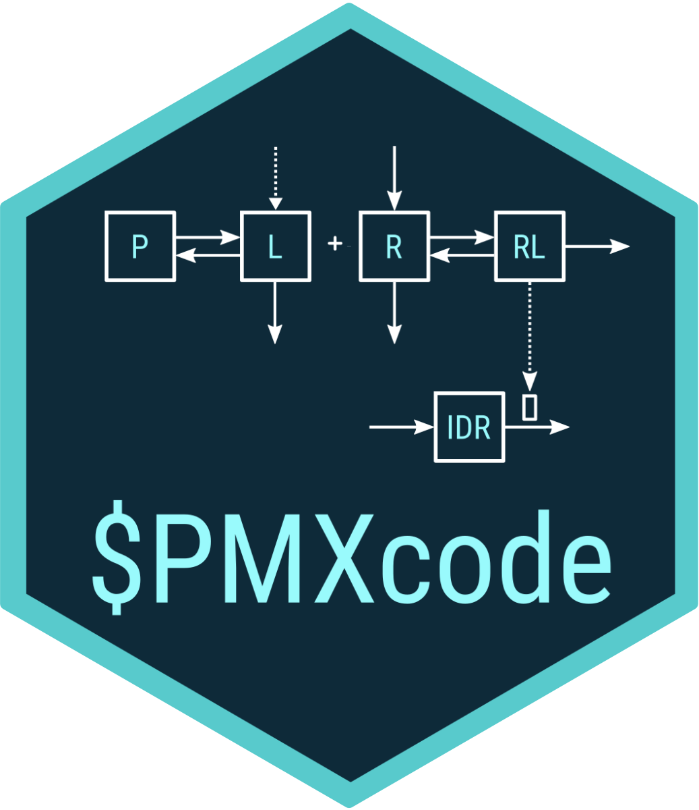

<table>
<tr>
<th>

</th>
<th>
  
</th>
<th style="font-weight:normal">
PMXcode is designed to generate pharmacometric model code for analysis
using the
<a href="https://www.iconplc.com/innovation/nonmem/">NONMEM</a> or
<a href="https://mrgsolve.org/">mrgsolve</a> software platforms. PMXcode
aims at reducing the time needed to create a new model code and at
promoting good coding practices. PMXcode provides a wide library of
template code and, as such, implements an opinionated approach to coding
and documenting pharmacometric models. Additionally, PMXcode supports
the automated creation of code for univariate covariate testing.
</tr>
</tr>
</table>

**Please, report any bug to <sb.pmlab@gmail.com> with a detailed
description of the problem and a reproducible example.**
